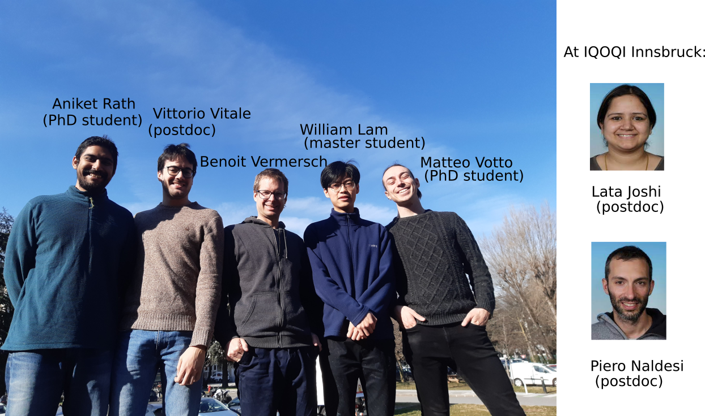

 
*Contact*: benoit.vermersch (at) lpmmc.cnrs.fr

I am an associate professor at the [University of Grenoble Alpes](https://www.univ-grenoble-alpes.fr), member of the [LPMMC](https://lpmmc.cnrs.fr/). I am also researcher at the institute for quantum optics and quantum information [(IQOQI)](http://iqoqi.at/en), in Innsbruck.

- Research interests

	+ Implementations of quantum processing units with cold atoms, trapped ions, superconducting qubits,...
	+ Measurement protocols for entanglement-related quantities, out-of-time ordered correlators, topological invariants.
	+ Many-body entanglement theory
	+ Quantum networks : Light-matter interfaces, quantum state transfer protocols, waveguide quantum electrodynamics.
	+ Tensor-network numerical methods: Matrix-Product-States and DMRG,TEBD related algorithms

- Want to now more?

	+ [arXiv](https://arxiv.org/search/?searchtype=author&query=Vermersch%2C+B)
	+ [Google Scholar](https://scholar.google.com/citations?user=gbPKVn4AAAAJ&hl=en)
	+ [ORCID](https://orcid.org/0000-0001-6781-2079)

##  The team

##  News

-*2023.08: Our article on Fermionic quantum processing with programmable neutral atom arrays has been published!* 
[Link to the paper](https://www.pnas.org/doi/10.1073/pnas.2304294120)

-*2023.08: Our article on Fermionic correlation functions from randomized measurements in programmable atomic quantum devices has been published!* 
[Link to the paper](https://doi.org/10.1103/PhysRevLett.131.060601)

##  Selected presentations available for download

- [Measuring scrambling and topological invariants via randomized measurements](Talks/20190218Vermersch_SolvayConference.pdf), Solvay workshop on quantum simulation, Brussels, 2019
- [Probing quantum matter via randomized measurements](Talks/20190226Vermersch_StateKeyLaboratory_PekingUniversity_USTCTalk1.pdf), Seminars at Shanxi and Shanghai University (USTC), 2019.
- [Quantum simulation and optimization with hot quantum networks](Talks/20190304Vermersch_USTCTalk2.pdf),  Seminars at Shanghai University (USTC), 2019.
- [Probing mixed-state entanglement with randomized measurements](Talks/20210126Vermersch_Toulouse.pdf), Talks at CoolMe/IQFA workshops, and LPT Toulouse, 2020-2021.
- Probing scrambling with randomized measurements, [Youtube Link](https://www.youtube.com/watch?v=QXQpylnXcD8&list=PLRcSLyvevJ1awX7IimKjVsGTd_IGgJHU0) , Talk for the Geoflow Workshop (2021) 
- [Mixed-state entanglement with randomized measurements -- Dynamical purification in synthetic quantum matter](http://benasque.org/2021scs/talks_contr/243_20210126Vermersch_Benasque.pdf), Talks at Benasque -- Entanglement in Strongly Correlated Systems, 2021, and Seminar at LPTMS (Orsay), March 2021.
- [Importance sampling of randomized measurements to probe entanglement](Talks/20210706Vermersch_MachineLearning2021.pdf), Machine Learning for Quantum, July 2021.
- [Probing entanglement in quantum technologies](Talks/20210927Vermersch_CPTGA.pdf), CPTGA Day (broad audience talk),  September 2021.
- [Making randomized measurements a universal measurement toolbox](Talks/BVermersch_InnsbruckNov42021.pdf), joint Innsbruck-Harvard seminar,  November 2021.
- [Intrication et ordinateurs quantiques](https://www.youtube.com/watch?v=nzCEfEiQVDE), broad-audience seminar at ONERA, March 2022 (Youtube video in French)
- [Probing the entanglement structure of many-body quantum states via
partial-transpose moments](Talks/Vermersch_BadHonnef11072022.pdf), Seminar at ICFO April 2022//Quantum measurements theory conference, Bad Honnef, July 2022
- [Understanding the role of entanglement in quantum computing](Talks/Vermersch_Kigali09152022.pdf) Quantum Africa Conference, Kigali, September 2022 (online)
- [Recent progress in the development of the randomized measurement toolbox](Talks/Vermersch_Tsinghua10122022.pdf) Seminar at Tsinghua's university, October 2022 (online)
- [Probing entanglement using the randomized measurement toolbox](Talks/Vermersch_Aussois11302022.pdf), GDR Meso Day (broad audience talk),  November 2022.
- [Talk on randomized measurements of the quantum Fisher information, and on Common randomized measurements](Talks/Vermersch_SanktAnton05242023.pdf), Workshop Many-boy quantum information, Sankt Anton, May 2023.

##  Teaching
- [Quantum algorithms](https://master-nanosciences.univ-grenoble-alpes.fr/quantum-algorithms-820935.kjsp?RH=1585217059025) (Master's degree university Grenoble Alpes): 
	+ [Lecture 1](Teaching/QuantumAlgorithmsBV_Lecture1.pdf): From classical computers to quantum computers

	#+ [Exercices 1](Teaching/TD1.pdf)
	#+ [Solutions 1](Teaching/TD1_solution.pdf)
	#+ [Lecture 2](Teaching/QuantumAlgorithmsBV_Lecture2.pdf): Quantum algorithms (1)
	#+ [Exercices 2](Teaching/TD2.pdf)
	#+ [Solutions 2](Teaching/TD2_solution.pdf)
	#+ [Lecture 2](Teaching/QuantumAlgorithmsBV_Lecture3.pdf): Quantum algorithms (2)
	#+ [Exercices 3](Teaching/TD3.pdf)
	#+ [Solutions 3](Teaching/TD3_solution.pdf)
	#+ [Lecture 4](Teaching/QuantumAlgorithmsBV_Lecture4.pdf): Quantum error correction
	#+ [Exercices 4](Teaching/TD4.pdf)
	#+ [Solutions 4](Teaching/TD4_solution.pdf)
	#+ [Lecture 5](Teaching/QuantumAlgorithmsBV_Lecture5.pdf): Quantum simulation and quantum optimization
	#+ [Exercices 5](Teaching/TD5.pdf)
	#+ [Solutions 5](Teaching/TD5_solution.pdf)
	#+ [Lecture 6](Teaching/QuantumAlgorithmsBV_Lecture6.pdf): Bonus Lecture: Quantum oracles and quantum supremacy
	#+ [Exercices 6](Teaching/TD6.pdf): Bonus exercice: The density matrix and quantum state tomography
	#+ [Solutions 6](Teaching/TD6_solution.pdf)
	#+ [Exam 2022/2023](Teaching/Exam2022.pdf)
	#+ [Solutions Exam 2022/2023](Teaching/Exam2022_solution.pdf)
	#+ [Exam 2021/2022](Teaching/Exam2021_enonce.pdf)
	#+ [Solutions Exam 2021/2022](Teaching/Exam2021_solution.pdf)

##  Short CV

- **2021** Habilitation diploma (HDR), University Grenoble-Alpes [Manuscript](Docs/ManuscritHDR_BVermersch_03062021.pdf)
- **2019-** Associate professor, University Grenoble-Alpes.
- **2017-2019** Senior scientist at the University of Innsbruck, group of Peter Zoller.
- **2013-2017** Postdoctoral fellow at the University of Innsbruck, group of Peter Zoller.
- **2010-2013** PhD student under the supervision of Jean-Claude Garreau, University of Lille.
- **2006-2010** École Polytechnique.

##   Python scripts
- Numpy scripts to analyze randomized measurements performed on quantum devices: [Github Link](https://github.com/bvermersch/RandomMeas) 
