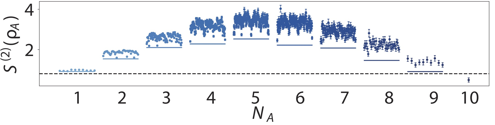

##   About me

 
*Contact*: benoit.vermersch (at) lpmmc.cnrs.fr

I am an associate professor at the [University of Grenoble Alpes](https://www.univ-grenoble-alpes.fr), member of the [LPMMC](https://lpmmc.cnrs.fr/). I am also researcher at the institute for quantum optics and quantum information [(IQOQI)](http://iqoqi.at/en), in Innsbruck.

I thank Agence Nationale de la Recherche (ANR-JCJC QRand), the Austrian Science Fundation (FWF-P32597N), and the LANEF and Nano-Science fundation, for financial support.

##  News
-*2022.01: Our paper on probing many-body quantum chaos with quantum simulators has been published in Physical Review X* 
[Link to the paper](https://journals.aps.org/prx/abstract/10.1103/PhysRevX.12.011018)

-*2021.12: Our paper on measuring the quantum Fisher information from randomized measurements  has been published in Physical Review Letters* 
[Link to the paper](https://journals.aps.org/prl/abstract/10.1103/PhysRevLett.127.260501)

-*2021.11: Our paper on importance sampling of randomized measurements  has been published in Physical Review Letters* 
[Link to the paper](https://link.aps.org/doi/10.1103/PhysRevLett.127.200503)
[Github](https://github.com/bvermersch/RandomMeas).

-*2021.10: Our paper on Quantum Variational Learning of the Entanglement Hamiltonian has been published in Physical Review Letters* 
[Link to the paper](https://journals.aps.org/prl/abstract/10.1103/PhysRevLett.127.170501)

-*2021.10: Our paper on Symmetry-resolved entanglement detection using partial transpose moments has been published in NPJ Quantum Information* 
[Link to the paper](https://www.nature.com/articles/s41534-021-00487-y)

-*2021.10: Matteo Votto starts his PhD on entanglement dynamics in quantum computers, and Lata Joshi starts her post-doc in Innsbruck.*

-*2021.06: Our paper on measuring on Entanglement Hamiltonian Tomography has been published in Nature Physics* 
[Link to the paper](https://www.nature.com/articles/s41567-021-01260-w)
[Press release](https://iqoqi.at/en/current/news/789-quantum-simulation-measurement-of-entanglement-made-easier)

-*2021.05: Habilitation. Thanks to my Jury A. Auffeves, J. Dalibard, N. Goldman, M. Lewenstein, M. Brune!* 
[Link to the manuscript](Docs/ManuscritHDR_BVermersch_03062021.pdf)

##  Research interests

### 1. Synthetic quantum systems for quantum technologies

  *Measurement of entanglement entropies in a trapped-ion quantum simulator (Science 364, 260-263 (2019))* 

- Implementations with cold atoms, trapped ions, superconducting qubits,...
- Measurement protocols for 
Entanglement-related quantities, out-of-time ordered correlators, topological invariants.
- *Selected publications*:
[NP 14, 827–831 (2018)](https://www.nature.com/articles/s41567-018-0151-7), 
[PRL 120, 050406 (2018)](https://journals.aps.org/prl/abstract/10.1103/PhysRevLett.120.050406), 
[Science 364, 260-263 (2019)](https://science.sciencemag.org/content/364/6437/260)

### 2. Quantum networks

  *Quantum simulation and optimization in a hot quantum network [PRB 99, 241302(R) (2019)]* 

- Light-matter interfaces, quantum state transfer protocols, waveguide quantum electrodynamics.
- *Selected publications*:
 [PRL 118, 133601 (2017)](https://journals.aps.org/prl/abstract/10.1103/PhysRevLett.118.133601), 
 [PRB 99, 241302(R) (2019)](https://journals.aps.org/prb/abstract/10.1103/PhysRevB.99.241302), 
 [PRL 122, 093601 (2019)](https://journals.aps.org/prl/abstract/10.1103/PhysRevLett.122.093601)

### 3. Tensor-network numerical methods

    *Matrix-Product-state simulation of an entangling gate mediated by a multimode waveguide [PRB 99, 241302(R) (2019)]*

 - Matrix-Product-States and DMRG,TEBD related algorithms.
 
##  Publications

- [arXiv](https://arxiv.org/search/?searchtype=author&query=Vermersch%2C+B)
- [Google Scholar](https://scholar.google.com/citations?user=gbPKVn4AAAAJ&hl=en)
- [ORCID](https://orcid.org/0000-0001-6781-2079)

##  Selected presentations available for download

- [Measuring scrambling and topological invariants via randomized measurements](Talks/20190218Vermersch_SolvayConference.pdf), Solvay workshop on quantum simulation, Brussels, 2019
- [Probing quantum matter via randomized measurements](Talks/20190226Vermersch_StateKeyLaboratory_PekingUniversity_USTCTalk1.pdf), Seminars at Shanxi and Shanghai University (USTC), 2019.
- [Quantum simulation and optimization with hot quantum networks](Talks/20190304Vermersch_USTCTalk2.pdf),  Seminars at Shanghai University (USTC), 2019.
- [Probing mixed-state entanglement with randomized measurements](Talks/20210126Vermersch_Toulouse.pdf), Talks at CoolMe/IQFA workshops, and LPT Toulouse, 2020-2021.
- Probing scrambling with randomized measurements, [Youtube Link](https://www.youtube.com/watch?v=QXQpylnXcD8&list=PLRcSLyvevJ1awX7IimKjVsGTd_IGgJHU0) , Talk for the Geoflow Workshop (2021) 
- [Mixed-state entanglement with randomized measurements -- Dynamical purification in synthetic quantum matter](http://benasque.org/2021scs/talks_contr/243_20210126Vermersch_Benasque.pdf), Talks at Benasque -- Entanglement in Strongly Correlated Systems, 2021, and Seminar at LPTMS (Orsay), March 2021.
- [Importance sampling of randomized measurements to probe entanglement](Talks/20210706Vermersch_MachineLearning2021.pdf), Machine Learning for Quantum, July 2021.
- [Probing entanglement in quantum technologies](Talks/20210927Vermersch_CPTGA.pdf), CPTGA Day (broad audience talk),  September 2021.
- [Making randomized measurements a universal measurement toolbox](Talks/BVermersch_InnsbruckNov42021.pdf), joint Innsbruck-Harvard seminar,  November 2021.

##  Teaching
- [Quantum algorithms](https://master-nanosciences.univ-grenoble-alpes.fr/quantum-algorithms-820935.kjsp?RH=1585217059025) (Master's degree university Grenoble Alpes): 
  * [Lecture 1: Quantum circuits](Teaching/QuantumAlgorithms_20212022_Lecture1.pdf)
  * [Exercices 1](Teaching/TD1.pdf)
  * [Exercices 1 (solutions)](Teaching/TD1_solution.pdf)
  * [Lecture 2: Quantum algorithms](Teaching/QuantumAlgorithms_20212022_Lecture2.pdf)
  * [Exercices 2](Teaching/TD2.pdf)
  * [Exercices 2 (solutions)](Teaching/TD2_solution.pdf)
  * [Lecture 3: Quantum error correction](Teaching/QuantumAlgorithms_20212022_Lecture3.pdf)
  * [Exercices 3](Teaching/TD3.pdf)
  * [Exercices 3 (solutions)](Teaching/TD3_solution.pdf)
  * [Lecture 4: Quantum simulation](Teaching/QuantumAlgorithms_20212022_Lecture4.pdf)
  * [Exercices 4](Teaching/TD4.pdf)
  * [Exercices 4 (solutions)](Teaching/TD4_solution.pdf)
  * [Lecture 5: Quantum optimization](Teaching/QuantumAlgorithms_20212022_Lecture5.pdf)
  * [Exercices 5](Teaching/TD5.pdf)
  * [Exercices 5 (solutions)](Teaching/TD5_solution.pdf)
  * [Lecture 6: Quantum oracles --- Quantum supremacy](Teaching/QuantumAlgorithms_20212022_Lecture6.pdf)
  * [Exam 2021-2022](Teaching/Exam2021_enonce.pdf)
  * [Exam 2021-2022 (solution)](Teaching/Exam2021_solution.pdf)

##  Short CV

- **2021** Habilitation diploma (HDR), University Grenoble-Alpes.
- **2019-** Associate professor, University Grenoble-Alpes.
- **2017-2019** Senior scientist at the University of Innsbruck, group of Peter Zoller.
- **2013-2017** Postdoctoral fellow at the University of Innsbruck, group of Peter Zoller.
- **2010-2013** PhD student under the supervision of Jean-Claude Garreau, University of Lille.
- **2006-2010** École Polytechnique.

##   Python scripts
- Numpy scripts to analyze randomized measurements performed on quantum devices: [Github Link](https://github.com/bvermersch/RandomMeas) 

